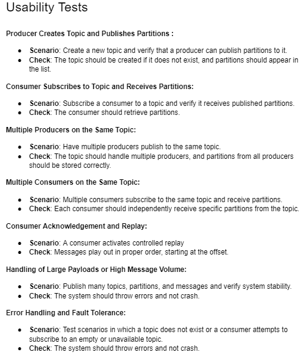

(Screenshotted for Readability)

Task 1) Preliminary Design

Usability Tests

Initial UML Diagram

Check initial_design.pdf

Java API

Testing Plan

Implementation Approach

/////////////

Task 3) Final Design

Q: Your final testing plan and your final list of usability tests;
A:

Unit Tests
createTopic: Tests the creation of a single topic and verifies its representation.
createInvalidTopic: Ensures that duplicate topic creation returns null.
createTopics: Verifies the creation of multiple distinct topics.
createPartition: Tests adding a partition to an existing topic.
createInvalidPartition: Ensures that partitions cannot be added to non-existent or invalid topics.
createPartitions: Verifies adding multiple partitions to a single topic.
createProducer: Tests the creation of a single producer.
createInvalidProducer: Ensures invalid allocation types or duplicate producers return null.
createProducers: Verifies the creation of multiple producers with distinct configurations.
createConsumerGroup: Tests the creation of a consumer group with valid balancing strategies.
createInvalidConsumerGroup: Ensures invalid balancing strategies or duplicate groups return null.
createConsumerGroups: Verifies the creation of multiple consumer groups.
createConsumer: Tests adding a consumer to an existing consumer group.
createInvalidConsumer: Ensures adding consumers to invalid or non-existent groups returns null.
createConsumers: Verifies adding multiple consumers to a consumer group.
deleteConsumer: Tests the removal of a valid consumer.
deleteInvalidConsumer: Ensures attempting to delete a non-existent consumer has no effect.
deleteConsumers: Verifies the removal of multiple consumers from a group.

Integration Tests
createAll: Simulates an end-to-end setup involving topics, partitions, producers, consumer groups, and consumers.
produceEventManual: Tests producing an event manually to a specific partition.
produceEventRandom: Verifies event production with random allocation to partitions.
produceInvalidEvent: Ensures invalid producer, topic, or partition configurations prevent event production.
produceEventsManual: Tests producing multiple events manually to a partition.
produceEventsRandom: Verifies producing multiple events with random allocation.
consumeEvent: Tests consuming a single event from a partition.
consumeInvalidEvent: Ensures consuming from invalid partitions or with invalid consumers returns null.
consumeEvents: Verifies consuming multiple events from a partition.
setValidConsumerGroupRebalancing: Tests updating a consumer group’s balancing method to a valid strategy.
setInvalidConsumerGroupRebalancing: Ensures invalid balancing methods or groups do not update the configuration.

Parallel Tests
testParallelProduce: Verifies producing multiple events concurrently across different producers.
testParallelConsume: Tests consuming events concurrently with multiple consumers across partitions.

CLI Test
// Execute
create topic topic1 string

// Error check
create partition topic2 partition1
// Execute
create partition topic1 partition11
create partition topic1 partition12
create partition topic1 partition13
create partition topic1 partition14

// Execute
create consumer_group consumer_group1 topic1 RoundRobin

// Error check
create consumer consumer_group2 consumer1
// Execute
create consumer consumer_group1 consumer1

// Execute
show consumer_group consumer_group1
delete consumer consumer1

// Execute
create producer producer1 String Random

// Execute
show topic topic1
produce event producer1 topic1 tributary/events/stringEvent.json partition1 string
show topic topic1
produce event producer1 topic1 tributary/events/stringEvent2.json partition1 string
show topic topic1

// Execute
create consumer consumer_group1 consumer1
show consumer_group consumer_group1
consume event consumer1 partition1
show consumer_group consumer_group1
consume event consumer1 partition1
show consumer_group consumer_group1

// Execute (Support multiple type of events)
create producer producer2 int Manual
create topic topic2 int
create partition topic2 partition21
create partition topic2 partition22
create partition topic2 partition23
create partition topic2 partition24
produce event producer2 topic2 tributary/events/intEvent.json partition24 int
produce event producer2 topic2 tributary/events/intEvent2.json partition24 int
show topic topic2
create consumer_group consumer_group2 topic2 Range
create consumer consumer_group2 consumer2
show consumer_group consumer_group2
consume event consumer2 partition5
show consumer_group consumer_group2
consume event consumer2 partition5
show consumer_group consumer_group2

Q: An overview of the Design Patterns used in your solution + Explanation of how you accommodated for the design considerations in your solution;
A:

1. Factory Pattern
   The TributaryCluster is responsible for creating producers, consumers, topics, and partitions. Methods like createProducer, createTopic, and createPartition serve as factory methods.
   These ensure consistent initialization of objects based on parameters such as type and configuration.

2. Strategy Pattern
   In the Producer class, the assignEvent method employs different allocation strategies, such as random or manual, based on the producer’s configuration.

3. Command Pattern
   The CLI encapsulates user commands (create, show, produce, consume) as methods mapped to specific functionalities of TributaryService.

Q: Your final UML diagram
A: Check final_design.pdf

Q: A brief reflection on the assignment, including on the challenges you faced and whether you changed your development approach.
A: Designing beforehand paid off tremendously for this assignemnt. I sat down a for a while to read the specs and design the UML Diagram. I didn't finish the UML, but it gave a much stronger idea of what I'm trying to build, which makes development very fast. This helped me appreciate software design much more. Some challeneges I face were implememnting generics to accomodate for different types of event, and concurrency. Generics made me redesign the system and test as a whole to accept <T>.

Q: Video
A: https://drive.google.com/file/d/1URZLB0J7Lw0EtzYvB_vakDaGXNgx63i-/view?usp=sharing

"The VEED watermark is cause I used it to speed up my vid 1.3x to under 5 minutes"
If link doesn't work, I also have it uploaded to the repo: tributary_video.mp4
